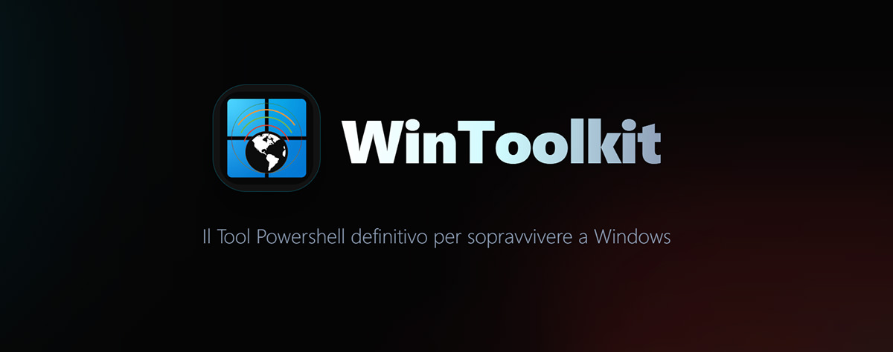

# WinToolkit Landing Page

<div align="center">
  

[](https://github.com/Magnetarman/WinToolkit/stargazers)
[](https://github.com/Magnetarman/WinToolkit/network)
[](https://github.com/Magnetarman/WinToolkit/issues)
[](https://github.com/Magnetarman/WinToolkit/watchers)

</div>

## 📋 Descrizione

Landing page ufficiale per **[WinToolkit](https://github.com/Magnetarman/WinToolkit)**, un potente strumento PowerShell per la manutenzione e l'ottimizzazione di sistemi Windows.

La pagina presenta in modo moderno e interattivo:

- Visualizzazione delle versioni disponibili (Main e Dev)
- Caratteristiche principali del tool
- Requisiti di sistema
- Istruzioni di installazione
- Video dimostrativi
- Statistiche in tempo reale del repository GitHub

## 🔗 Progetto Principale

> [!WARNING]
>
> Questa è la landing page del progetto. Il codice sorgente principale di WinToolkit è disponibile nel repository sottostante.

[**WinToolkit su GitHub**](https://github.com/Magnetarman/WinToolkit) — Repository ufficiale del progetto

## 🛠️ Tecnologie Utilizzate

| Tecnologia      | Descrizione                                   |
| --------------- | --------------------------------------------- |
| React 19        | Libreria UI per la creazione dell'interfaccia |
| TypeScript      | Tipizzazione statica per codice più sicuro    |
| Vite            | Tool di build veloce e moderno                |
| Tailwind CSS v4 | Framework CSS utility-first                   |
| Lucide React    | Libreria di icone                             |
| Motion React    | Libreria per animazioni                       |

## ✨ Caratteristiche Principali

1. **Visualizzazione Versioni** — Download per versione Main (stabile) e Dev (sviluppo)
2. **Funzionalità** — Panoramica completa delle capacità del tool
3. **Requisiti di Sistema** — Specifiche minime e consigliate
4. **Guida all'Installazione** — Istruzioni passo-passo
5. **Video Dimostrativi** — Tutorial visuali
6. **Statistiche GitHub** — Dati aggiornati automaticamente ogni ora:
   - ⭐ Numero di stelle
   - 🐛 Issue aperte
   - 📥 Pull request
   - 📦 Versioni disponibili
   - 📊 Andamento commit settimanali (ultime 24 settimane)
   - 👥 Elenco contributori

## 🔄 Aggiornamento Dati GitHub

I dati delle statistiche GitHub vengono aggiornati automaticamente ogni ora tramite GitHub Action. Il sito fetch direttamente il file JSON dal repository GitHub remoto, garantendo dati sempre aggiornati senza necessità di rebuild.

## 🚀 Esecuzione del Progetto

### Prerequisiti

- Node.js 18+
- npm 9+

### Installazione Dipendenze

```bash
npm install
```

### Avvio in Modalità Sviluppo

```bash
npm run dev
```

Il server di sviluppo sarà disponibile su: `http://localhost:3000`

### Build per la Produzione

```bash
npm run build
```

I file ottimizzati saranno generati nella cartella `dist/`

> **Nota**: Il comando `npm run build` esegue automaticamente la generazione del file `github-data.json` prima di creare la build.

### Preview della Build

```bash
npm run preview
```

Visualizza l'applicazione in locale prima del deploy.

## 📁 Struttura del Progetto

```
WinToolkit-LandingPage/
├── public/                  # File statici
│   ├── header.jpg          # Banner principale
│   ├── WinToolkit-icon.png # Icona del progetto
│   └── github-data.json    # Dati GitHub (auto-generato)
├── src/                     # Codice sorgente
│   ├── components/         # Componenti React riutilizzabili
│   │   ├── CommunitySection.tsx
│   │   ├── CopyCommand.tsx
│   │   ├── DescriptionBox.tsx
│   │   ├── Footer.tsx
│   │   ├── Hero.tsx
│   │   ├── RepositoryStatus.tsx
│   │   ├── RequirementsSection.tsx
│   │   ├── StatCard.tsx
│   │   ├── StatsGrid.tsx
│   │   ├── VersionCard.tsx
│   │   ├── VersionTabs.tsx
│   │   └── YouTubeSection.tsx
│   ├── hooks/              # Custom hooks
│   │   ├── useGitHubData.ts
│   │   └── useLazySection.ts
│   ├── types/              # Definizioni TypeScript
│   ├── utils/              # Funzioni di utilità
│   ├── App.tsx             # Componente principale
│   ├── index.css           # Stili globali
│   └── main.tsx            # Entry point
├── dist/                   # Build di produzione
├── .github/workflows/      # GitHub Actions
├── index.html
├── package.json
├── tsconfig.json
└── vite.config.ts
```

## 📄 Licenza

Questo progetto è distribuito sotto licenza **MIT**. Per maggiori dettagli, consulta il file [LICENSE](LICENSE).

---

## 🎗 Autore

Creato con ❤️ da [Magnetarman](https://magnetarman.com/).

---
