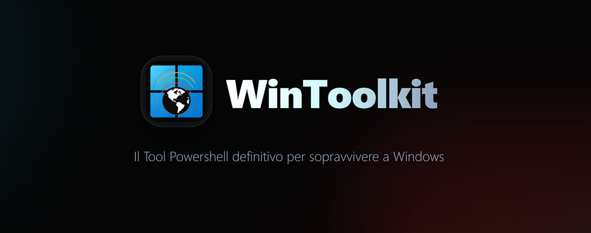

# WinToolkit Landing Page

<div align="center">
  

[](https://github.com/Magnetarman/WinToolkit/stargazers)
[](https://github.com/Magnetarman/WinToolkit/network)
[](https://github.com/Magnetarman/WinToolkit/issues)
[](https://github.com/Magnetarman/WinToolkit/watchers)

</div>

## 📋 Description

Official landing page for **[WinToolkit](https://github.com/Magnetarman/WinToolkit)**, a powerful PowerShell tool for maintaining and optimizing Windows systems.

The page presents in a modern and interactive way:

- Available versions overview (Stable, Dev and GUI)
- Main features of the tool
- System requirements (Windows >= 10 1809, >= 50 GB of free disk space, Internet connection)
- Installation instructions with quick command copy
- Demonstration videos
- Real-time GitHub repository statistics
- Full bilingual support (Italian / English) with a language switcher

## 🔗 Main Project

> [!WARNING]
>
> This is the project's landing page. The main WinToolkit source code is available in the repository below.

[**WinToolkit on GitHub**](https://github.com/Magnetarman/WinToolkit) — Official project repository

## 🛠️ Technologies Used

| Technology      | Description                                |
| --------------- | ------------------------------------------ |
| React 19        | UI library for building the interface      |
| TypeScript      | Static typing for safer code               |
| Vite            | Fast and modern build tool                 |
| Tailwind CSS v4 | Utility-first CSS framework                |
| Lucide React    | Icon library                               |
| Motion React    | Animation library                          |

## ✨ Main Features

1. **Version Overview** — Downloads for the Stable (stable), Dev (development) and GUI (ALPHA) versions
2. **Features** — Complete overview of the tool's capabilities
3. **System Requirements** — Windows >= 10 (1809), >= 50 GB of free disk space and Internet connection
4. **Installation Guide** — Step-by-step instructions with quick command copy
5. **Demonstration Videos** — Visual tutorials
6. **GitHub Statistics** — Data automatically updated every 6 hours:
   - ⭐ Number of stars
   - 🐛 Open issues
   - 📥 Pull requests
   - 📦 Available versions
   - 📊 Weekly commit trend (last 24 weeks)
   - 👥 Contributors list

## 🔄 GitHub Data Update

The GitHub statistics data is automatically updated every 6 hours via a GitHub Action (cron `0 */6 * * *`). The site fetches the JSON file directly from the remote GitHub repository, ensuring always up-to-date data without the need for a rebuild.

## 🚀 Running the Project

### Prerequisites

- Node.js 18+
- npm 9+

### Install Dependencies

```bash
npm install
```

### Start in Development Mode

```bash
npm run dev
```

The development server will be available at: `http://localhost:3000`

### Build for Production

```bash
npm run build
```

The optimized files will be generated in the `dist/` folder

> **Note**: The `npm run build` command automatically generates the `github-data.json` file before creating the build.

### Preview the Build

```bash
npm run preview
```

View the application locally before deploying.

## 📁 Project Structure

```
WinToolkit-Landing/
├── public/                  # Static files
│   ├── header.jpg          # Main banner
│   ├── WinToolkit-icon.png # Project icon
│   └── github-data.json    # GitHub data (auto-generated)
├── src/                     # Source code
│   ├── components/         # Reusable React components
│   │   ├── CommunitySection.tsx
│   │   ├── CopyCommand.tsx
│   │   ├── DescriptionBox.tsx
│   │   ├── Footer.tsx
│   │   ├── FooterLink.tsx
│   │   ├── Hero.tsx
│   │   ├── LanguageSwitcher.tsx
│   │   ├── LazySection.tsx
│   │   ├── RepositoryStatus.tsx
│   │   ├── RequirementsSection.tsx
│   │   ├── StatCard.tsx
│   │   ├── StatsGrid.tsx
│   │   ├── VersionCard.tsx
│   │   ├── VersionTabs.tsx
│   │   ├── YouTubeSection.tsx
│   │   └── index.ts
│   ├── hooks/              # Custom hooks
│   │   ├── useGitHubData.ts
│   │   └── useLazySection.ts
│   ├── i18n/               # Internationalization (IT/EN)
│   │   ├── LanguageContext.tsx
│   │   └── translations.ts
│   ├── types/              # TypeScript definitions
│   │   └── index.ts
│   ├── utils/              # Utility functions
│   │   └── cache.ts
│   ├── App.tsx             # Main component
│   ├── index.css           # Global styles
│   └── main.tsx            # Entry point
├── dist/                   # Production build
├── .github/workflows/      # GitHub Actions
├── index.html
├── package.json
├── tsconfig.json
└── vite.config.ts
```

## 📄 License

This project is distributed under the **MIT** license. For more details, see the [LICENSE](LICENSE) file.

---

## 🎗 Author

Created with ❤️ by [Magnetarman](https://magnetarman.com/).

---
